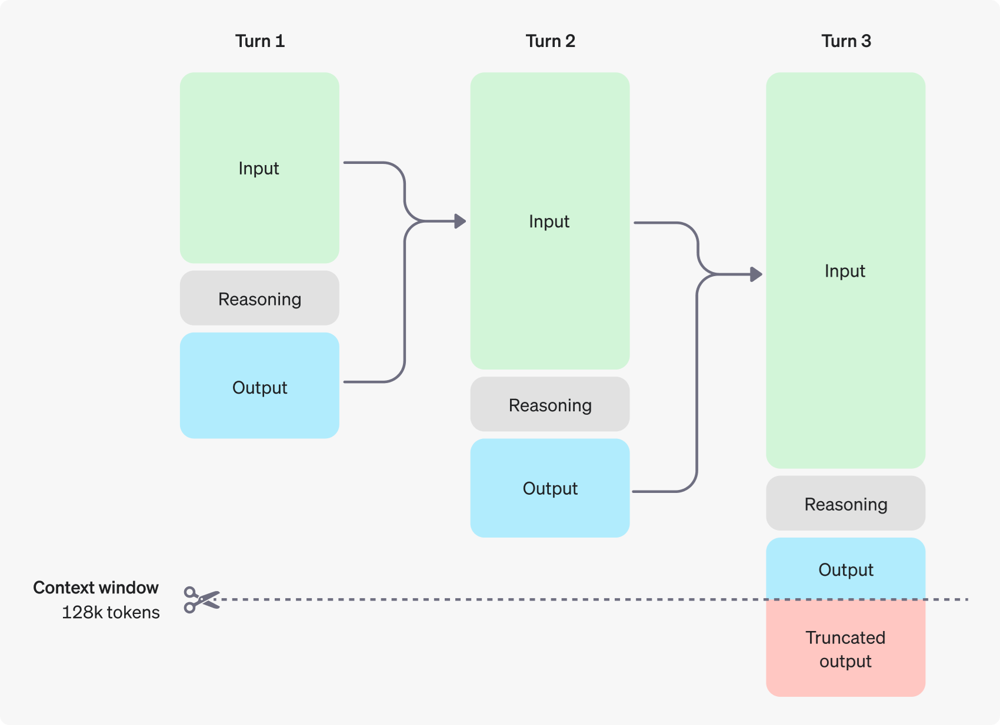

# 📚 LLM Foundations Handbook

Welcome to **LLM Foundations Handbook**. The AI landscape is evolving at breakneck speed, and making sense of the countless models, engines, and frameworks can be overwhelming.

This repository serves as a foundational "mental model" and reference guide for the modern Generative AI ecosystem. It strips away the hype and breaks down exactly how AI systems are built, run, and integrated today.

## Table of Contents

- [Who is this for?](#who-is-this-for)
- [The AI Stack](#the-ai-stack)
- [Model](#model)
  - [Parameters (Size)](#parameters-size)
  - [Open-Source Model Landscape](#open-source-model-landscape)
  - [Approaches (Dense vs. MoE)](#approaches-dense-vs-moe)
  - [Capabilities](#capabilities)
  - [Chat Templates](#chat-templates)
  - [Architecture](#architecture)
  - [Context Length (Context Window)](#context-length-context-window)
  - [Formats](#formats)
  - [Quantization](#quantization)
  - [Fine-Tuning](#fine-tuning)
  - [Sampling & Generation](#sampling--generation)
- [Inference](#inference)
  - [The Inference Landscape](#the-inference-landscape)
  - [The VRAM Bottleneck](#the-vram-bottleneck)
  - [The GPU Landscape](#the-gpu-landscape)
- [Hugging Face Ecosystem](#hugging-face-ecosystem)
- [Agents & Tool Use](#agents--tool-use)
- [Retrieval-Augmented Generation (RAG)](#retrieval-augmented-generation-rag)

## Who is this for?

- **Software Engineers:** Looking to transition into AI/LLM development and needing to understand the tech stack.
- **Product Managers:** Needing a clear, jargon-free understanding of what is technically possible (and required) to build AI features.
- **Tech Enthusiasts:** Anyone wanting to understand the difference between a parameter, an inference engine, and a vector database.

---

## The AI Stack

Here is an example of an AI system architecture stack. Each system may have more or fewer layers, but this stack is a common foundational standard.

| Layer       | Example           |
| ----------- | ----------------- |
| Application | VS Code           |
| Agent       | GitHub Copilot    |
| Provider    | AWS Bedrock       |
| Inference   | vLLM              |
| Model       | Claude Sonnet 4.6 |

---

## Model

### Parameters (Size)

Think of parameters as the "brain cells" and "synapses" of an AI. When we say a model is "8 billion parameters" (8B) or "400 billion parameters" (400B), we are referring to the total count of these numbers.

- **What they are:** In a neural network, parameters consist of weights and biases. They are numerical values that determine the strength of the connection between different artificial neurons.
- **What they do:** During training, the model reads vast amounts of text and constantly adjusts these weights. If it guesses the next word correctly, the weights that led to that guess are strengthened. Over billions of adjustments, these weights end up encoding grammar, facts, reasoning pathways, and language structure.
- **Analogy:** If an LLM is a massive audio mixing board, the parameters are the billions of tiny sliders and knobs perfectly tuned to produce intelligent, coherent text.

---

### Open-Source Model Landscape

Because massive models require expensive hardware, developers release "families" of models. Smaller models (under 10B) are fast and can run locally on laptops or phones. Larger models (100B+) require powerful, multi-GPU servers but offer vastly superior logic, reasoning, and world knowledge.

| Model Family    | Developer  | Sizes             | Key Release Date |
| :-------------- | :--------- | :---------------- | :--------------- |
| **Llama 3.1**   | Meta       | 8B, 70B, 405B     | July 2024        |
| **Qwen 3.5**    | Alibaba    | 0.8B to 397B      | February 2026    |
| **Ministral 3** | Mistral AI | 3B, 8B, 14B       | November 2025    |
| **Granite 4.0** | IBM        | 1B, 3B, 7B, 32B   | October 2025     |
| **Phi-4**       | Microsoft  | 3.8B, 5.6B, 14.7B | December 2024    |
| **Gemma 3**     | Google     | 1B, 4B, 12B, 27B  | March 2025       |
| **GPT-OSS**     | OpenAI     | 20B, 120B         | August 2025      |

---

### Approaches (Dense vs. MoE)

This refers to how parameters are utilized when the model is processing text and generating a response.

<!-- prettier-ignore -->
| Architecture | Description | Open-Source Examples | Pros |
| :----------- | :---------- | :------------------- | :--- |
| **Dense Models** | Every single parameter in the neural network is activated and used to process every single word (token). | Llama 3.3 (70B), Qwen 2.5 (72B) | Simpler architecture, easier and more stable to train. |
| **Mixture of Experts (MoE)** | The model is divided into smaller sub-networks ("experts"). A router activates only the 1 or 2 experts best suited for a specific token. | Llama 4 Scout (109B), DeepSeek-V4 | Massive efficiency gain — only a fraction of parameters are active per token, enabling faster generation. |

---

### Capabilities

Modern LLMs have expanded drastically beyond just predicting the next word into specific, highly advanced skill sets.

<!-- prettier-ignore -->
| Capability | Description | Modern Examples |
| :--------- | :---------- | :-------------- |
| **Reasoning** | The ability to logically deduce answers and follow "chain-of-thought" processes before outputting an answer. | DeepSeek-R1 / V4, GPT-5.4 |
| **Vision (Multimodality)** | Processing images/video alongside text natively, allowing the model to describe images or solve visual puzzles. | Llama 4, Claude 4.6 Sonnet |
| **Tools (Function Calling)** | Generating structured commands (like JSON) to trigger external tools (e.g., browsing the web, running code). | Llama 4, Hermes 3 |
| **Embedding** | Turning text into high-dimensional mathematical vectors for semantic search and RAG workflows. | Nomic-embed-text, BGE |
| **Insertion (FIM)** | "Fill-in-the-Middle" models trained to look at text before and after a cursor to generate the missing middle (used in coding). | Qwen2.5-Coder, StarCoder2 |

---

### Chat Templates

A **Chat Template** is the structural "wrapper" that translates a list of conversational messages (System, User, Assistant) into a single long string of text that the model can actually understand.

- **The Blueprint of Interaction:** Raw LLMs don't naturally know where a user's prompt ends and their own response should begin. Templates use specific **control tokens** (like `<|im_start|>` or `[INST]`) to signal these boundaries.
- **Structure vs. Intelligence:** Advanced features—especially **Tool Calling** and **Object Generation (JSON)**—depend heavily on template precision. Significant formatting mistakes (for example, missing control tokens or inconsistent turn boundaries) can cause tool calls to fail or produce malformed outputs.
- **The "Jinja2" Standard:** Most modern models (Llama, Mistral, Qwen) use **Jinja2** templating. This allows the model to dynamically change its behavior based on whether it needs to call a tool, display a thought process, or provide a standard reply.

[Example of a Chat Template with Tool Calling support](./public/examples/phi4-mini-chat-template.txt)

---

### Architecture

The architecture is the structural wiring of the neural network—how it actually processes the data you feed it.

<!-- prettier-ignore -->
| Architecture Type | How it Works | Pros & Cons |
| :---------------- | :----------- | :---------- |
| **Attention (Transformers)** | Uses "Self-Attention" to look at all words in a sentence simultaneously and calculate how strongly they relate to one another. | **Pros:** Incredible reasoning and precise recall. **Cons:** Memory required scales quadratically as context grows (doubling context quadruples RAM). |
| **Mamba (SSMs)** | Processes text selectively, compressing the history of the conversation into a fixed-size mathematical state as it reads left-to-right. | **Pros:** Handles massive context windows with minimal RAM. **Cons:** Can struggle with recalling specific data buried in the middle. |
| **Hybrid (Mamba + Attention)** | Interleaves Mamba layers with standard Transformer attention layers. | **Pros:** Combines Mamba's speed with Transformer's sharp recall. **Cons:** Highly complex to engineer and run on consumer hardware. |

---

### Context Length (Context Window)

Think of context length as the AI's "short-term working memory." It is completely separate from its permanent parameter "brain."

- **Quadratic vs. Linear Scaling:** Expanding this memory is a massive hardware challenge. Standard Transformers scale quadratically (doubling the context quadruples the RAM requirement). Newer architectures like Mamba scale linearly, allowing for massive context windows using a fraction of the RAM.

**Context Limits:** As AI evolves, standard context windows continue to expand:

<!-- prettier-ignore -->
| Tier | Token Limit | Best Used For | Examples |
| :--- | :---------- | :------------ | :------- |
| **Standard** | 8K to 32K | Daily chat, summarizing short articles, or debugging short scripts. | Llama 3 8B, Mistral 7B |
| **Long Context** | 128K to 256K | Digesting entire novels, financial reports, or large codebases. | Qwen 3, Llama 3.3 |
| **Frontier Context** | 1M to 10M | Ingesting massive document repositories or retaining long-term memory. | Llama 4 Scout (10M), Claude 4.6 (1M) |

<figure style="text-align: center;">
  
  <figcaption>Diagram showing how multi-turn inputs and outputs consume a 128k token context window, eventually leading to truncated outputs.</figcaption>
</figure>

---

### Formats

Once a model is trained, its billions of parameters need to be saved into a file. The format you choose depends entirely on your hardware and software stack.

<!-- prettier-ignore -->
| Format | Best For | Description |
| :----- | :------- | :---------- |
| **Safetensors** | Cloud / Python | Hugging Face standard. Loads incredibly fast and cannot harbor malicious code. |
| **GGUF** | Local AI / CPUs | llama.cpp standard. Portable file that easily splits the workload between CPUs and GPUs. |
| **ONNX** | Enterprise Apps | Microsoft/Meta standard for strict interoperability across different software stacks. |
| **MLX** | Apple Silicon | Apple's native format optimized to leverage the unified memory of M-series chips. |
| **MLC** | Web / Mobile | Compressed to run entirely client-side via WebAssembly/WebGPU without a backend server. |

---

### Quantization

Quantization is the process of compressing the model to make it smaller and faster to run, usually for local use.

- **How it works:** Originally, model weights are stored in high-precision formats like 16-bit floating-point (FP16). Quantization rounds these numbers down to lower precisions, like 8-bit, 4-bit, or even 2-bit integers.
- **Benefits:** Drastically reduces the file size and the RAM/VRAM required to run the model, while significantly speeding up text generation.
- **Drawbacks:** You lose a tiny bit of precision, though modern quantization methods make this loss almost unnoticeable for most everyday tasks.
- **Common Schemes:** Popular formats include **Q4_K_M** and **Q8_0** (GGUF quantization levels for llama.cpp), **AWQ** (Activation-Aware Weight Quantization), and **GPTQ** (GPU-optimized post-training quantization).

---

### Fine-Tuning

Fine-tuning is the process of taking an already trained "base" model and training it further on a smaller, highly targeted dataset to change its behavior or master a specific task.

- **The Concept:** A base model possesses vast general knowledge, but its default instinct is simply to predict the next word. Fine-tuning shapes it into a useful tool like a conversational chatbot or a strict JSON generator.
- **Instruction Tuning:** The most common form of fine-tuning. Models are trained on thousands of structured human conversations to learn how to follow instructions and respect safety guardrails.
- **Full Fine-Tuning:** The computationally expensive method where every single parameter in the model is updated during training.
- **PEFT & LoRA:** Parameter-Efficient Fine-Tuning freezes the base model and trains a tiny, lightweight "adapter" on top of it. LoRA (Low-Rank Adaptation) allows a developer to fine-tune a massive model using a single consumer graphics card in just a few hours.
- **Human Alignment:** The final "polish" where models are tuned to match human values and preferences. While **RLHF** (Reinforcement Learning from Human Feedback) traditionally requires training a complex separate "reward model," newer techniques like **DPO** (Direct Preference Optimization) and **GRPO** allow the model to learn directly from preferred vs. rejected examples, making alignment faster and more stable.

[LoRA Fine-Tuning Example](./public/examples/lora-fine-tuning.py)

---

### Sampling & Generation

When an LLM predicts the next word, it doesn't just pick one; it generates a massive list of probabilities for every token in its vocabulary. "Sampling" is the set of rules that dictates how the model chooses the final winner from that list.

- **What it is:** A collection of mathematical dials that control the randomness, creativity, and predictability of the AI's output.
- **What it does:** Instead of always picking the \#1 most likely next word (which often results in dry, robotic, or repetitive text), sampling allows the model to occasionally pick the 2nd, 10th, or 50th most likely word. This injects variety and a more human-like flow into the response.
- **Analogy:** Imagine a chef deciding what ingredient to add next to a soup. A strict chef (low randomness) always picks the most obvious, safe choice (salt). A creative chef (high randomness) might occasionally throw in something less expected (cinnamon) to create a unique flavor profile.
- **Structured / Constrained Decoding:** Libraries like **Outlines** and **LMFE** go a step further by mathematically _constraining_ the sampling process to guarantee outputs conform to a specific format (e.g., a JSON schema or regex pattern). This is increasingly the standard approach for reliable function-calling and object generation, eliminating the need for fragile post-processing.

<!-- prettier-ignore -->
| Parameter | How it Works | Best Used For |
| :-------- | :----------- | :------------ |
| **Temperature** | The master dial for randomness. A value of 0 makes the model strictly pick the highest-probability token every time. Higher values (e.g., 0.7 to 1.0) flatten the probability curve, giving less likely words a fighting chance. | **Low (0.0 - 0.3):** Coding, math, factual data extraction. **High (0.7+):** Brainstorming, creative writing, storytelling. |
| **Top-K** | Sorts the predicted tokens by probability and outright discards everything below the "K"th rank. If Top-K is set to 40, the model is only allowed to choose from the top 40 most likely next words. | Trimming the absolute worst guesses. It prevents the model from hallucinating or generating gibberish by cutting off ultra-low probability tokens. |
| **Top-P (Nucleus)** | Adds up the probabilities of the top tokens until they hit a combined "P" threshold (e.g., 0.90 or 90%). It then discards all remaining tokens. The pool of choices shrinks or grows dynamically based on how confident the model is. | A smarter, more dynamic alternative to Top-K. Great for maintaining coherent text while still allowing for a natural, controlled variance in vocabulary. |
| **Repetition Penalty** | Artificially lowers the probability of tokens that have already appeared recently in the generated text, making the model look for fresh words. | Preventing the model from getting stuck in an infinite loop where it repeats the exact same phrase over and over. |

---

## Inference

If an LLM’s weights (the data) are the "brain," the inference engine is the "nervous system" and "muscles." An inference engine is the software responsible for loading the model into memory, processing your prompt, and performing the massive mathematical calculations required to generate words.

### The Inference Landscape

<!-- prettier-ignore -->
| Category | Engine | Description |
| :------- | :----- | :---------- |
| **The Standards** | Transformers | Hugging Face's "Research Lab" engine. Essential for building, but memory-heavy. |
| | vLLM | The "Data Center Standard." Fastest for concurrent users using smart memory management. |
| | llama.cpp | The "Everyman’s Engine." Written in C++ to run GGUF models on everyday CPUs and Macs. |
| **High-Performance** | TensorRT-LLM | The absolute highest throughput possible, but locked entirely to NVIDIA chips. |
| | SGLang | Blazing-fast engine optimized for complex prompt workflows and agents using prefix caching. |
| | ExLlamaV2 | The "Local Speed Demon" for single-user generation on consumer NVIDIA GPUs. |
| **User-Friendly** | Ollama / LM Studio | Lightweight desktop applications for browsing, downloading, and chatting with local models. |
| | GPT4All | Privacy-first desktop application focused on reading your local documents (RAG). |
| | Llamafile | Packages an LLM and its engine into a single executable file (like a portable USB drive). |

**Which engine should you choose?**

| Your Goal                          | Recommended Tool                       |
| :--------------------------------- | :------------------------------------- |
| **Learning / Fine-Tuning**         | Transformers                           |
| **Building a SaaS / Scalable API** | vLLM (General) or SGLang (Agents/JSON) |
| **Private Desktop Chatbot**        | LM Studio, Ollama, or GPT4All          |
| **Old Laptop / Mac / No GPU**      | llama.cpp (via Ollama/LM Studio)       |
| **Max Speed on Home NVIDIA GPU**   | ExLlamaV2                              |
| **Mobile App / Web Browser Dev**   | MLC LLM                                |

---

### The VRAM Bottleneck

While the Inference Engine is the software muscle, the actual physical hardware determines what you can run and how fast you can run it.

The most important concept to understand about AI hardware is **The VRAM Bottleneck**. Generating text (inference) is rarely limited by the raw compute speed (teraFLOPS) of a chip. Instead, it is almost entirely bound by two factors: **VRAM Capacity** (Video RAM) dictates _if_ a model can run, and **Memory Bandwidth** dictates _how fast_ it generates text.

The entire model must be loaded into the GPU's ultra-fast memory to run efficiently. If a model requires 40GB of memory and your GPU only has 24GB, it will severely bottleneck or fail to run entirely, regardless of how fast the processor itself is.

To calculate if a model will fit on your graphics card, keep these factors in mind:

- **The Model Weight:** 1 Billion Parameters requires roughly **1 GB of VRAM** at 8-bit precision, or **~0.5 GB** at 4-bit precision.
- **Context Window Overhead (KV Cache):** You must reserve roughly 1 to 2 gigabytes of VRAM to "remember" the ongoing conversation and process your prompts.
- **System Overhead:** Your operating system and display typically consume 1 to 2 gigabytes of VRAM just to keep your screen running.

Therefore, to run an 8B parameter model at high speeds with a decent conversation history, an **8GB to 12GB** consumer graphics card is the practical minimum.

---

### The GPU Landscape

<!-- prettier-ignore -->
| GPU / Hardware | Platform | Compatible Inference Engines |
| :------------- | :------- | :--------------------------- |
| **NVIDIA** | CUDA | TensorRT, vLLM, ONNX Runtime (CUDA/TensorRT EPs), Triton Inference Server, llama.cpp (cuBLAS), Text Generation Inference (TGI) |
| **AMD Radeon** | ROCm | MIGraphX, vLLM (ROCm backend), ONNX Runtime (ROCm EP), llama.cpp (HIPBLAS), TGI |
| **Apple Silicon** | Metal | MLX, Core ML, llama.cpp (Metal), ONNX Runtime (Core ML EP), ExecuTorch |
| **Intel Arc** | DPC++ (OneAPI) | OpenVINO, IPEX-LLM (formerly BigDL), ONNX Runtime (OpenVINO EP), llama.cpp (SYCL backend) |
| **Google TPUs** | JAX/XLA | TensorFlow Serving, PyTorch/XLA, JetStream, vLLM (TPU backend), MaxText |
| **AWS Inferentia** | AWS Neuron SDK | Transformers NeuronX, vLLM (Neuron backend), TGI (Neuron), TorchServe |
| **CPU-Only** | OpenCL / x86 / ARM | DeepSparse (Neural Magic), ONNX Runtime (CPU EP), OpenVINO, llama.cpp, NCNN |

---

## Hugging Face Ecosystem

If GitHub is where developers store and collaborate on code, **Hugging Face is where AI teams store and collaborate on models**. That is why many engineers call it the **"GitHub of AI."**

The platform combines artifact hosting, versioning, community discovery, and deployment into one place. Instead of repositories full of source code only, you get model repositories, dataset repositories, and runnable AI demos.

<!-- prettier-ignore -->
| Hugging Face Component | Why It Matters |
| :--------------------- | :------------- |
| **Hub** | The default place to discover, version, and share models, datasets, and demo apps. |
| **Model Card** | Captures license, limitations, evaluation data, and intended use before you adopt a model. |
| **Transformers** | Standard Python API for loading, testing, training, and fine-tuning many architectures. |
| **Datasets** | Makes large-scale data loading, preprocessing, and reproducible experiments much easier. |
| **Tokenizers** | Ensures fast, consistent text preprocessing across training and inference. |
| **PEFT / TRL** | Enables practical fine-tuning/alignment (LoRA, DPO, etc.) on limited hardware. |
| **Spaces / Inference Endpoints** | Lets teams share prototypes instantly and ship production inference without custom infra. |

### Common Workflow

1. Browse the Hub the way you would browse GitHub repos.
2. Read the model card (like checking a repo README before using it).
3. Pull and test locally with `transformers`.
4. Fine-tune with PEFT (for example, LoRA) and publish a new revision.
5. Share via Spaces or deploy an API with Inference Endpoints.

### Practical Tips

- Always review a model card for license, intended use, safety notes, and benchmark context.
- Pin exact model revisions when moving from experimentation to production.
- Keep tokenizer and model versions aligned to avoid subtle inference errors.
- Treat Hub artifacts like code: use branches, pull requests, and immutable tags for releases.

---

## Agents & Tool Use

If a standard LLM is a "brain in a jar" that can only answer questions based on its training data, an **Agent** is that same brain given hands, eyes, and a to-do list.

Agents are systems where an LLM is used as the core reasoning engine to autonomously decide which actions to take, execute them, evaluate the results, and repeat the process until a complex goal is achieved.

### The ReAct Loop (Reason + Act)

The foundational architecture for almost all modern AI agents is the **ReAct** framework. It forces the model to interleave internal reasoning with external actions.

Instead of just blurting out an answer, the agent is programmed to operate in a continuous feedback loop consisting of three phases:

<!-- prettier-ignore -->
| Phase | What Happens | Example |
| :---- | :----------- | :------ |
| **Thought** | The LLM acts as an internal monologue, breaking down the user's prompt and deciding what it needs to do next. | *"To find out if we have enough stock to fulfill this order, I first need to check the inventory database for SKU-992."* |
| **Action** | The LLM outputs a structured command (usually JSON) to trigger a specific tool. | `call_tool("check_inventory", {"sku": "SKU-992"})` |
| **Observation** | The external tool runs and returns raw data back to the LLM, which the LLM reads to inform its next "Thought". | `{"status": "success", "stock_count": 4}` |

The system repeats this `Thought → Action → Observation` loop continuously until the LLM decides it has enough information to provide a final answer to the user.

### Tool Use (Function Calling) Demystified

The most important concept to grasp about Tool Use is that **the LLM does not actually run code or browse the internet itself.** Here is exactly how "Tool Calling" works under the hood:

1. **The Setup:** The developer writes standard code functions (e.g., a Python script to query a database or a weather API).
2. **The Prompt:** The developer passes the _descriptions_ of these tools to the LLM (e.g., "You have a tool called `get_weather`. It requires a `location` parameter.").
3. **The Generation:** If the LLM decides it needs the weather, it stops generating standard text and instead generates a perfectly formatted JSON object requesting that tool.
4. **The Execution:** The developer's application (the orchestrator) intercepts this JSON, pauses the LLM, runs the actual Python code locally, and feeds the resulting data back into the LLM's prompt as an "Observation".

---

## Retrieval-Augmented Generation (RAG)

Retrieval-Augmented Generation (RAG) is the critical bridge connecting the **Application** layer to the **Model** layer. While standard LLMs are limited by their training cutoff dates and lack access to private information, RAG allows an AI to securely read, analyze, and cite external, live, or proprietary data (like your company's internal PDFs, live databases, or massive code repositories) _without_ needing to retrain or fine-tune the model.

- **The Analogy:** If an LLM is a brilliant student taking an open-book exam, RAG is the hyper-efficient librarian who instantly fetches the exact textbook pages the student needs to read right before answering the question.

### The RAG Pipeline (How it Works)

A standard RAG system operates in a multi-step workflow behind the scenes every time a user asks a question:

<!-- prettier-ignore -->
| Step | Phase | What Happens |
| :--- | :---- | :----------- |
| **1** | **Ingestion & Chunking** | Large documents (PDFs, wikis, code) are broken down into smaller, manageable paragraphs or "chunks." This ensures the data is bite-sized enough for the AI to process efficiently. |
| **2** | **Embedding** | A specialized, lightweight AI (an Embedding Model) converts these text chunks into high-dimensional arrays of numbers (vectors). This translates human language into mathematical coordinates. |
| **3** | **Storage** | These vectors are saved in a **Vector Database**. Texts with similar meanings (e.g., "puppy" and "dog") are stored close together in this mathematical space. |
| **4** | **Retrieval** | When a user types a prompt, their question is also converted into a vector. The database searches for the stored vectors mathematically closest to the question's vector, instantly retrieving the most relevant chunks of text. |
| **5** | **Augmentation & Generation** | The Application layer takes the user's original prompt _plus_ the retrieved text chunks, bundles them together, and sends them to the **Inference** engine. The **Model** reads this augmented prompt and generates an accurate answer based purely on the provided context. |

---

### The RAG Tech Stack

Building a RAG system introduces a few specialized tools into the broader AI stack:

<!-- prettier-ignore -->
| Component | Purpose | Popular Examples |
| :-------- | :------ | :--------------- |
| **Orchestrators** | The "glue" frameworks that wire the Application layer to the Vector DB and the LLM API. They handle the logic of the entire pipeline. | **LangChain**, **LlamaIndex**, **Haystack** |
| **Vector Databases** | Specialized databases built specifically to store, index, and query vector embeddings at lightning speed. | **ChromaDB** (Local), **Qdrant**, **Pinecone** (Cloud), **Milvus** |
| **Embedding Models** | Lightweight models designed strictly to translate text into vector coordinates. | **Nomic-embed-text** (Local), **OpenAI text-embedding-3**, **BGE-M3** |
| **Rerankers** | An optional but powerful secondary model that acts as a quality filter. It double-checks the retrieved documents and re-orders them to ensure the LLM only sees the absolute most relevant information. | **Cohere Rerank**, **BGE-Reranker**, **Jina Reranker** |

---

### RAG Approaches

As AI has evolved, the basic RAG pipeline has been upgraded to handle much more complex, messy, and interconnected data. Developers now categorize RAG into a few distinct architectural approaches:

<!-- prettier-ignore -->
| Approach | How it Works | Best Used For |
| :------- | :----------- | :------------ |
| **Naive RAG** | The foundational "Chunk → Embed → Retrieve → Generate" pipeline. It takes the user's exact prompt, finds the closest matching text chunks, and feeds them to the LLM. | Simple Q&A bots, querying highly structured and clean internal wikis, or basic customer support. |
| **Advanced RAG** | Introduces "Pre-Retrieval" and "Post-Retrieval" optimizations. Before searching, it might use a smaller AI to rewrite or expand the user's query for better search results. After retrieving the chunks, it uses a **Reranker** model to filter out irrelevant noise before sending the final context to the LLM. | Enterprise search, analyzing dense financial PDFs, or any system where accuracy and avoiding hallucinations are critical. |
| **GraphRAG** | Combines standard vector databases with **Knowledge Graphs**. Instead of just finding paragraphs with similar words, it maps out the mathematical relationships between entities (e.g., mapping that "Person A" works for "Company B" which owns "Product C"). | Investigating complex networks, connecting the dots across hundreds of separate documents, or legal discovery. |
| **Agentic RAG** | The most dynamic approach. Instead of a hard-coded pipeline, an AI Agent is given access to search tools and decides _autonomously_ if it needs to search, what queries to run, and if it needs to run follow-up searches based on the first set of results (multi-hop reasoning). | Coding assistants debugging a massive repository, complex research tasks, and open-ended analysis. |

---

to be continued....
